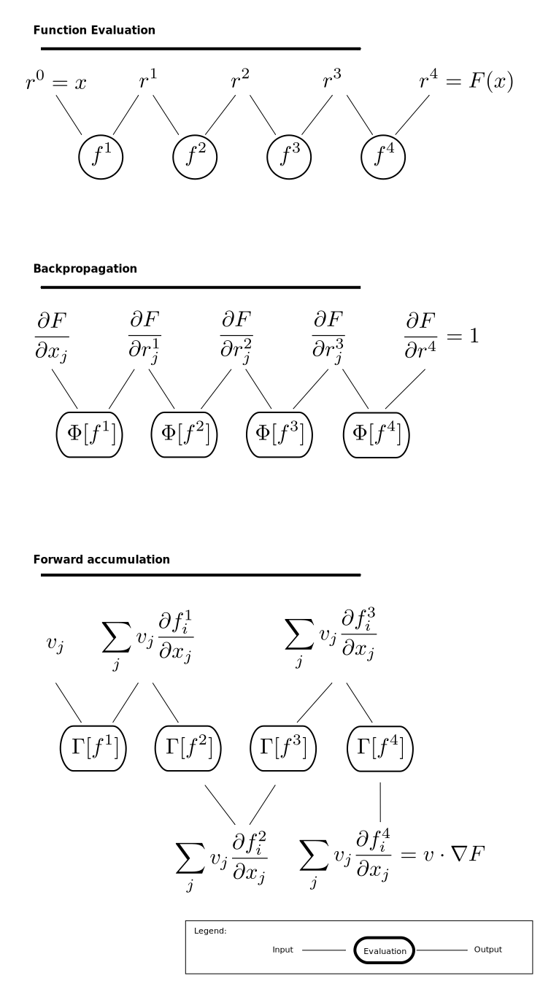

Automatic Differentiation and Cosmology Simulation
==================================================

One project at `Berkeley Center for Cosmological Physics <http://bccp.berkley.edu>`_ is to study the 
recovery the cosmic initial condition from observations of the later time universe.

Cosmic initial condition is the density fluctuation of the universe about 13.7 billion years ago,
when the main form of energy in the universe was still dominated by the cosmic microwave background (CMB).
Due to the finite speed of light, any direct measurements of the `CMB <https://en.wikipedia.org/wiki/Cosmic_microwave_background>`_, 
including space based programs such as Planck, WMAP and COBE, and ground based programs such as ACT-Pole, PolarBear, 
can only observe a thin slice of cosmic initial condition.
For the rest of Universe, we are only able to observe an evolved state. The close to us, the older the Universe we observe
has grown to. The data about the latest universe usually comes as a catalogue of galaxies. (e.g. `Malavasi et al. <https://arxiv.org/abs/1509.08964>`_)
The slightly older universe was captured by the measurements of Lyman-alpha Forest. (e.g. `Lee et al. <https://arxiv.org/abs/1409.5632>`_.)
Gravitational lensing measures a projected view along the line of sight direction. (e.g. `Amara et al. <https://arxiv.org/abs/1205.1064>`_)

The recovery of the full cosmic initial condition is an inversion problem, which reverts the time evolution from the observed
field :math:`y`,

.. math::

    x = S^{-1}(y) ,

where :math:`x` is the unknown initial condition, and :math:`y` is the observation. :math:`S` is the dynamical model
of the universe. At the resolution we can currently probe, :math:`S` is determined mostly by gravity. 

We must realize two difficulties of the problem:

1. The observation comes with noise; there is also uncertainty in the forward model :math:`S`. For a noisy inversion problem,
can be written as an optimization problem,

.. math::

    \mathrm{ minimize}_{x = \hat{x}} \chi^2(x) = \left|\frac{S(x) - y}{\sigma}\right|^2 ,

where :math:`\sigma` quantifies the level of noise.

The solution :math:`x=\hat{x}` is our best estimate of the cosmic initial condition. There are ways of deriving the uncertainty
of :math:`\hat{x}`.

2. It has a very large dimensionality. :math:`x` and :math:`y` are fields defined on a 3-dimenional space. 
For example a mesh of :math:`128^3` points, the number of elements in the vectors :math:`x` and :math:`y` become millions.

3. The model of structure formation (:math:`S`) is nonlinear, and becomes non-perturbative quickly as the resolution increases.
We use ordienary differential equation (ODE) solvers to follow the evolution of the structure.
A particular simple family of solvers that are frequently used in cosmology are Particle-Mesh solvers.
We refer the readers to the classical book
`Computer Simulation Using Particles <http://dl.acm.org/citation.cfm?id=62815>`_ by Hockney and Eastwood for further references.
We therefore a facing a non-linear optimization problem in a high dimensional space.
Gradient of the objective function :math:`\chi^2(x)` is a crucial ingredient for solving such problems.

There are generic software tools (Automatic Differentiation software) to automatically evaluate the gradient of any function.
We were hoping to use these generic software tools in our problem.
We surveyed three packages, `Tensorflow <https://www.tensorflow.org/>`_, `Theono <http://deeplearning.net/software/theano/>`_,
and `autograd <https://github.com/HIPS/autograd>`_.
The landscape was of quite a bit of misery when we try to build a Particle Mesh solver out of these packages:
we find all three of them lacking the elements to describe our Particle Mesh solver.

This motivates the writing of this blog.
We will review the mechanism how automatic differentiation works.
Next, we will build the gradient operators that are useful in a Particle-Mesh solver.
In the long term, we would like to patch the generic AD software packages to include these operators.

Automatic Differentiation
-------------------------

Automatic Differentiation (AD) is a relatively new technology to the audience in astronomy and cosmology inspite of
the growing popularity in machine learning. At the `2016 AstroHackWeek <http://astrohackweek.org/2016/>`_,
the attendees organized a session to explore the landscape of automatic differentiation software. One idea was that 
we shall try to AD more in astronomy if we are to define the boundary of the technology.
This blog was partially inspired by the discussion amongst the astronomers during that session.

The recent tide of popularity of AD is partially due to the movement of deep learning.
Training large neural networks demand effective and efficient optimization algorithms, because
the dimenionality of the problem (number of neural nodes) is large.
Popular optimization algorithms (e.g. Gradient Descent -- the only embeded optimizer in TensorFlow, or L-BFGS which we use
in the cosmic initial condition problem) demands the evaluation of the gradient.

A large landscape of AD beyond deep learning is in the context of inversion of dynamical systems.
Many physical problems can be written as solutions of a time evolution of differential equations.
The solution to these equations can be written as the product of a sequence of evolution operators
(nested function evaluations).
AD can be applied to evaluate the gradient of the final condition regarding to the intial condition, which is also called
`sensitivity analysis` in this context. 
Due to the complicity of the problem, AD in inversion problems is
usually tailored to a specialized form that suits to the particular dynamical system.
(c.f. `Sengupta et al. <https://www.ncbi.nlm.nih.gov/pmc/articles/PMC4120812/>`_).
In these problems, however, a generic AD software is not used,
because it usually does not implement the necessary operators, and it also fails to recognize shortcuts, or optimizations in
the evaluation sequence.

We indeed ran into these problems as we attempt to apply generic AD software to particle-mesh simulations. If we believe optimization
are secondary, the the first problem becomes the primary barrier. For particle-mesh simulations, we need the AD software to
support discrete fourier transforms and window resampling operations. We will try to bridge the gap, but shall first revisit
what AD actually does.

De-mysterifying AD
------------------

    Figure: Illustration of the evaluation sequences of automatic differentiation.

The basics of AD start from the chain-rule of differentiation, which claims that

    If we have two functions :math:`y=f(x)` and :math:`z=g(y)=g(f(x))`, then

    .. math::

        \frac{\partial z_j }{\partial x_i} = \sum_k \frac{\partial z_j}{\partial y_k} \frac{\partial y_k}{\partial x_i}
                            = \frac{\partial z_j}{\partial y_k} \cdot \frac{\partial y_k}{\partial x_i} .

We see that the chain-rule converts gradient of nested functions to a sequence of tensor products.

Let's now consider a scalar that comes from nested evaluation of :math:`n` functions,

.. math::

    F(x) := \left(f^1 \odot \cdots \odot f^n \right)(x) = f^n(f^{n-1}(\cdots (f^1(x)) \cdots ))) .

:math:`f^i` maps to concepts in real world problems:

- as a time step in a dynamical system; then the nested functions are simply evolving the dyanmical system forward in time.

- as a layer in the neural network; then the nested functions are simply stacking layers of neural network.

We shall name the intemediate variables :math:`r^{(i)}`,

.. math::

    r^n = F(x) ,

    r^i = f^i(r^{i-1}) ,

    r^0 = x .

This function is illustrated in the `function evaluation` section of the figure.

Applying chain rule to :math:`\nabla F`, we find that

.. math::

    \nabla_j F = \frac{\partial F}{\partial r^0_j} = 
        \left[\Pi_{i=1, n} \frac{\partial f^i}{\partial r^{i-1}}\right]_j ,

where :math:`\Pi` represents tensor product on the corresponding dimension.
(known as the Einstein summation rule, c.f. `numpy.einsum`)
An automatic differentation software constructs and evaluates this long tensor product expression for us.

There are many ways to evaluate this expression.
We will look at two popular schemes, the `reverse accumulation/backpropagation` scheme and
the `forward accumulation` scheme. Both are described in the Wikipedia entry of `Automatic Differentiation <https://en.wikipedia.org/wiki/Automatic_differentiation>`_.

Here will will motivate these schemes by defining two different types of functional operators.

Backward
++++++++

For a function `f` defined on the domain :math:`f : X \to Y`, we define gradient-adjoint-dot operator as

.. math::

    \Psi[f, x](v) = \sum_i v_i \frac{\partial f_i}{\partial x_j} .

It is implied that :math:`v \in Y` and the domain of :math:`\Psi[f, x]` is :math:`\Psi[f, x] : Y \to X`.

Notice how the summation eliminate the indexing of the function; while the indexing for the gradient remains.

Using :math:`\Psi^i = \Psi[f^i, r^i]`, the chain-rule above can be reorganized as a sequence of function evaluations
of :math:`\Psi^i`

.. math::

    \nabla F_j = (\Psi^1 \cdots (\Psi^{n-1}(\nabla_j f^n))\cdots)_j .

The process is illustrated in Section `backpropagation` of the figure. 
We see that at each evaluation of :math:`\Psi^i`, we
obtain the gradient of :math:`F` relative to the intermiedate variable :math:`r^i`, :math:`\nabla_{r^i} F`. Because we apply
:math:`\Psi^i` in the decreasing order of :math:`i`, 
this method is called the `backward propagation` or `reverse accumulation`.

This method is also called `adjoint method` in the analysis of dynamical systems, because the summation is along the `adjoint`
index of the jacobian :math:`\frac{\partial f_i}{\partial x_j}`.
The main drawback of backpropagation is
that it requires one to store the intemediate results along the function evaluation in order to compute the
gradient-adjoint-dot operators.
However, the method gives the full gradient against the free variables `x_j` after one full accumulation, making it at advantage
in certain problems than the `forward accumulation` we will describe next.

In all three automatic differentiation software packages we checked (TensorFlow, Theono, or autograd), a method of
looking up the the gradient-adjoint-dot operator is provided; either as a member of the operator entity or as an external
dictionary.

Forward
+++++++

In contrast, we can define an gradient-dot operator,

.. math::

    \Gamma[f, x](u) = \sum_j \frac{\partial f_i}{\partial x_j} u_{j} .

It is implied that :math:`u \in X` and the domain of :math:`\Gamma[f, x]` is :math:`\Gamma[f, x] : X \to Y`.

Notice the summation is over the indexing of the free variable, :math:`x_j`. Hence the name does not have `adjoint` like the previous
operator. One way to think of :math:`\Gamma[f]` is that it rotates :math:`u` by the jacobian.

With the gradient-dot operator of :math:`\Gamma^i = \Gamma[f^i, r^i]`, we can write down the `forward accumulation` rule of AD:

.. math::

    \sum_j \nabla_j F u_j = \Gamma^n (\cdots (\Gamma^1(u)) \cdots) .

This process is illustrated in the `Forward accumulation` section of the figure.
We see that at each evaluation of :math:`\Gamma^i`, we obtain the directional
derivative of :math:`r^i` along :math:`u`, :math:`\sum \frac{\partial r^i}{\partial x_j} u_j`. The accumulation goes along the increasing
order of :math:`i`, making the name `forward accumulation` a suitable one.

The advantage of forward accumulation is that one can evaluate the gradient as the function :math:`F` is evaluated, and no intemediate
results need to be saved. This is clearly a useful feature when the number of nesting (layers of neural network or number of time steps)
is high.
However, the cost is we can only obtained a directional derivative. In some applications it is useful (e.g. computing Hession for Newton-CG or trust-region
Newton-CG methods). When the full gradient is desired, one need to run
the `forward accumulation` many times - as many as the number of the free parameters, which could be prohibatively high.

We shall note that this method is also called `forward senstivity` in the analysis of dynamical systems.

Two Useful Operators in Particle-Mesh solvers
---------------------------------------------

In this section we write down two families of gradient-adjoint-dot operators that are useful in AD of cosmological simulations.
The first family is the Discrete Fourier transforms. The second family is the resampling windows. At the time of this blog,
no popular AD software implement all of these gradient-adjoint-dot operators. We will list them in this section for further 
references.

Discrete Fourier Transform
++++++++++++++++++++++++++

Discrete Fourier transform is the discretized version of Fourier Transform.
It is a commonly used density matrix operator in the modelling of physical process.
This is mostly because finite differentiation can be written as multiplication
in the spectrum space.

The gradients involve complex numbers which are tuples of two real numbes. We therefore do not include a proof
in this blog. The gradient that is conveniently used is

.. math::

    \nabla_z = \frac{\partial}{\partial x} + \imath \frac{\partial}{\partial y} ,

for :math:`z = x + \imath y`. It is related to the Wirtinger derivatives (Fourier transform is a harmonic function).

The gradient-adjoint-dot operator of a discrete fourier transform
is its dual transform. Specifically,

.. math::

    \Psi[\mathrm{fft}, X](V) = \mathrm{ifft}(V) ,

    \Psi[\mathrm{rfft}, X](V) = \mathrm{irfft}(V) ,

    \Psi[\mathrm{ifft}, Y](V) = \mathrm{fft}(V) ,

    \Psi[\mathrm{irfft}, Y](V)_j = \left\{
                \begin{matrix}
                        \mathrm{rfft}(V)_j & \mathrm{ if } j = N - j, \\
                            2 \mathrm{rfft}(V) & \mathrm{ if } j \neq N - j.
                \end{matrix} \right.

where :math:`\Psi` is the gradient-adjoint-dot operator. Notably, the free variables :math:`X` and :math:`Y`
do not show up in the final expressions.
This is because Fourier transforms are linear operators. We also notice that the gradient of
complex to real transform has an additional factor of 2 for most modes.
This is because the hermitian conjugate frequency mode also contributes to the gradient.

The complex version of Discrete Fourier Transform is implemented in TensorFlow (GPU only), Theono, and autograd. Though
it appears the version in autograd is incorrect. The real-complex transforms (rfft and irfft)
are not implemented in any of the packages. We use the real-complex transforms in the particle-mesh solvers,
to properly capture the hermitian property of the fourier modes of the density field, which is a real valued field.

Resampling Windows
++++++++++++++++++

The resampling window converts a field representation between particles and meshes.
It is written as

.. math::

    B_j(p, q, A) = \sum_i W(p^i, q^j) A_i ,

where :math:`p^i` is the position of `i`-th particle/mesh point and :math:`q^j` is the position
of `j`-th mesh/particle point; both are usually vectors themselves (the universe has 3 spatial dimensions).

:math:`W` is the resampling window function. A popular form is the
cloud-in-cell window, which represents a linear interpolation:

.. math::

    W(x, y) = \Pi_{a} (1 - h^{-1}\left|x_a - y_a\right|) ,

for a given size of the window :math:`h`.

Most windows are seperatable, which means they can be written as a product of
a scalar function :math:`W_1`,

.. math::

    W(x, y) = \Pi_{a} W_1(\left|x_a - y_a\right|),

For these windows,

.. math::

    \frac{\partial W}{\partial x_a} = \frac{\partial W}{\partial y_a} = 
    W_1^\prime(\left|x_a - y_a\right|) \Pi_{b \neq a} W1(\left|x_b - y_b\right|) .

We can then write down the gradient-adjoint-dot operator of the window

.. math::

    \Psi[B, \{p, q, A\}]_p(v)_{(i,a)} = \sum_j \frac{\partial W(p^i, q^j)}{\partial p^i_a} A_i v_j ,

    \Psi[B, \{p, q, A\}]_q(v)_{(j,a)} = \sum_i \frac{\partial W(p^i, q^j)}{\partial q^j_a} A_i v_j ,

    \Psi[B, \{p, q, A\}]_A(v)_i =  \sum_j W(p^i - q^j) v_j .

The first gradient corresponds to the displacement of the source. The second gradient corresponds to
the displacment of the destination. The third gradient corresponds to the evolution of the field.
Usually in a particle mesh simulation, either one of the source and the destination is a fixed grid, and
the corresponding gradient vanishes.

They are a bit complicated because we need to loop of the spatial dimension index :math:`a`.
It is possible to extend these expressions to Smoothed Particle Hydrodynamics if one allow :math:`h` to be a free variable
as well.

Unlike the partial support of Fourier Transforms, none of the three packages we surveyed
(TensorFlow, Theono and autograd) recognizes these resampling window operators.
Fully implementing these operators will remove the final barrier between a generic AD software
and our cosmic initial condition problem.
